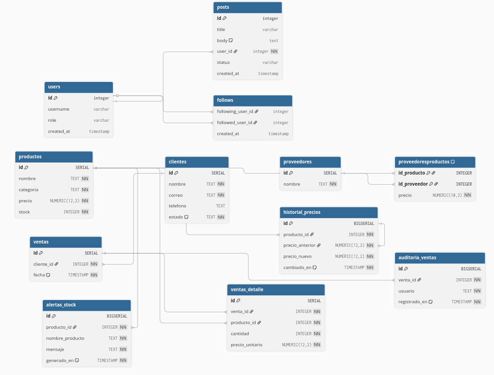

# 🏪 Gestión de Inventario para una Tienda de Tecnología - TechZone

## 📖 Descripción del Proyecto

Este proyecto corresponde a un **examen práctico en PostgreSQL** cuyo objetivo es implementar un sistema de gestión de inventario y ventas para la tienda **TechZone**, un negocio especializado en productos tecnológicos.  

La solución propuesta busca resolver problemas de **control de stock, registro de ventas, seguimiento de clientes y proveedores, así como automatización de procesos críticos** mediante el uso de **tablas, restricciones, procedimientos almacenados, funciones y triggers en PostgreSQL**.

Los creadores del proyecto son:

👨‍💻 **Ángel David Pinzón**  
👨‍💻 **Andrés Forero**

---

## 📌 Contexto del Problema

Actualmente, **TechZone** enfrenta dificultades en la gestión de inventario debido a que utiliza hojas de cálculo, lo que ha generado:

- ❌ Errores en el control de stock.  
- ❌ Dificultades en el seguimiento de ventas.  
- ❌ Gestión manual de proveedores.  
- ❌ Ausencia de automatización en registros de compras.  

Para solventar estos problemas, se diseña una **base de datos en PostgreSQL** que asegure la integridad de la información, facilite consultas avanzadas y garantice procesos confiables en la administración del inventario.

---

## ⚙️ Especificaciones del Sistema

El sistema debe permitir:

1. **Registro de productos** con categoría, precio, stock y proveedor.  
2. **Registro de clientes** con datos de contacto y control de estado (activo/inactivo).  
3. **Registro de ventas** con detalle de productos vendidos, cantidades y precios.  
4. **Registro de proveedores** con los productos que suministran.  
5. **Consultas avanzadas** para analizar productos más vendidos, ingresos por proveedor y clientes frecuentes.  
6. **Procedimientos almacenados con transacciones** que validen disponibilidad de stock antes de procesar ventas.  
7. **Triggers automáticos** para actualización de stock, auditoría de ventas, alertas de productos agotados, historial de cambios de precio y control de integridad de datos.

---

## 🗄️ Modelo Entidad-Relación

El sistema se basa en un **modelo E-R normalizado hasta 3FN** que incluye las entidades principales: `productos`, `clientes`, `ventas`, `ventas_detalle`, `proveedores`, y tablas de apoyo como `historial_precios`, `auditoria_ventas` y `alertas_stock`.  

📌 **Diagrama E-R:**  


---

## 📂 Estructura del Repositorio

El repositorio debe contener los siguientes archivos:

- **modelo_er.png** → Diagrama Entidad-Relación del sistema.  
- **dll.sql** → Creación de la base de datos, tablas y restricciones.  
- **dml.sql** → Datos de prueba para cada entidad (mínimo 15 registros por tabla).  
- **queries.sql** → Consultas avanzadas para análisis de datos.  
- **procedureAndFunctions.sql** → Procedimiento almacenado y funciones necesarias para la gestión de ventas.  
- **README.md** → Documentación y guía de uso del proyecto.  

---

## 📄 Entregables Detallados

### 1. **Modelo E-R**
- Entidades, atributos, relaciones y cardinalidades.  
- Normalización hasta la **3FN**.  

### 2. **db.sql**
- Scripts de creación de todas las tablas.  
- Definición de **claves primarias y foráneas**.  
- Restricciones de integridad (**NOT NULL, UNIQUE, CHECK**).  

### 3. **insert.sql**
- Inserción de **mínimo 10 registros por tabla**.  
- Datos realistas que representen clientes, proveedores, productos y ventas.  

### 4. **queries.sql**
Consultas avanzadas obligatorias:
1. Productos con stock menor a 5 unidades.  
2. Ventas totales de un mes específico.  
3. Cliente con más compras realizadas.  
4. Los 5 productos más vendidos.  
5. Ventas en un rango de fechas de tres días y un mes.  
6. Clientes que no han comprado en los últimos 6 meses.  

### 5. **procedureAndFunctions.sql**
- Procedimiento para registrar una venta validando:  
  - Existencia del cliente.  
  - Disponibilidad de stock.  
  - Uso de **transacciones y manejo de errores con RAISE**.  

### 6. **Triggers**
- Actualización automática de stock al registrar ventas.  
- Registro de auditoría en cada venta.  
- Notificación en caso de stock agotado.  
- Validación de unicidad y formato en clientes.  
- Historial de cambios de precios.  
- Bloqueo de eliminación de proveedores con productos activos.  
- Validación de fechas de ventas.  
- Reactivación automática de clientes inactivos tras una nueva compra.  

---

## 🚀 Instrucciones de Uso

1. **Clonar el repositorio**
   ```bash
   git clone <url-del-repositorio>
   cd <nombre-del-repo>
